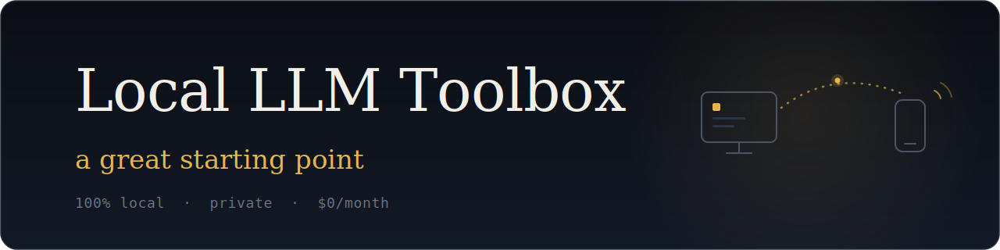

<p align="center">
  
</p>

**One `docker compose up` gives you a private AI that works for you** — a chat UI in your browser, a coding agent in your terminal, an HTTP API for scripting it, and an optional Telegram bridge so you can text your PC from anywhere. No cloud, no API keys, no accounts, no monthly bill. Nothing you type ever leaves your machine.

This repo exists because of one surprise: Google's **Gemma 4 E4B** is small enough to run on an everyday 16 GB laptop and competent enough to do real work. If you've only ever met AI through a browser tab and a subscription — if you're a business student wondering what "agentic AI" actually means beyond the buzzword — this is a cheap way to find out on your own hardware, before you bet a startup idea or a dollar on it. It won't outthink the frontier cloud models, and it doesn't need to. It's a great starting point.

## What it can do

The agents here don't just chat — they read and write files in your `projects/` folder and act on what they find:

- **Turn messy lecture notes into a study guide** — summary, glossary, practice questions, saved as a file you keep
- **Read a stack of papers** and map out who agrees with whom and what's still unsettled
- **Rank job or internship listings** against your written criteria (the one agent allowed on the internet)
- **Fix failing code** — read the repo, patch it, run the tests to confirm
- **Answer texts from your phone** — the sandboxed Telegram bridge (off by default) turns your PC into a private assistant you can message from the bus

Every one of these is a worked example with a copy-paste prompt in **[COLLEGE_USE_CASES.md](COLLEGE_USE_CASES.md)** — go there first once the stack is up.

## Quick Start

### Prerequisites

- **Hardware:** ~16 GB free disk (models are ~12 GB). CPU mode needs ~12 GB of RAM available to Docker — the main model loads at ~10 GB (16 GB machines: workable; 8 GB machines: won't fit). GPU mode: any NVIDIA card helps — Ollama splits layers between GPU and CPU automatically; full offload needs ~11 GB VRAM.
- [Docker Desktop](https://docs.docker.com/get-docker/) installed and running
- (Optional) NVIDIA GPU. **Docker Desktop on Windows needs only a current NVIDIA Windows driver — nothing installed inside WSL2.** Native Linux Docker Engine needs the [NVIDIA Container Toolkit](https://docs.nvidia.com/datacenter/cloud-native/container-toolkit/install-guide.html) on the host. Details in SETUP.txt.
- **On native Linux (any distro):** before first build, run `printf 'HOST_UID=%s\n' "$(id -u)" > .env` so the container user matches your uid and can write to `./projects` — see "Linux users — distro notes" in SETUP.txt.
- **On Fedora / RHEL / openSUSE:** Docker isn't the default container runtime — see "Linux users — distro notes" in SETUP.txt for installing Docker CE or using Podman. The compose file already carries SELinux relabel hints, so once Docker is installed the stack just works.

### Start the stack

**Without GPU** (macOS, CPU-only Linux, Windows without NVIDIA):

```
docker compose up -d
docker compose run --rm opencode
```

**With NVIDIA GPU** — copy the override once, then use the same plain commands as CPU mode:

```
copy docker-compose.gpu.yml docker-compose.override.yml   # Windows (cp on macOS/Linux)
docker compose up -d
docker compose run --rm opencode
```

> Docker Compose merges `docker-compose.override.yml` automatically into every command, so there are no extra flags to remember and no way to accidentally recreate the stack CPU-only. The override copy is gitignored (a per-machine choice). To return to CPU mode: delete it and `docker compose up -d --force-recreate`.

### Shutting down

```
docker compose down
```

To delete all data (models) and start fresh:

```
docker compose down -v
```

## What's in the box

- **Ollama** — Local LLM inference server (GPU-accelerated on NVIDIA, CPU elsewhere)
- **Agent API** — HTTP service for dispatching agent presets (`localagent/presets/`) to Ollama
- **OpenCode** — Interactive AI coding agent (terminal UI)
- **Open WebUI** — Browser-based chat UI at `http://localhost:3000`
- **Telegram Bridge** — Sandboxed Telegram-to-agent-api bridge (inert by default, behind a compose profile)
- **Models** — Gemma 4 E4B and GRM-2.5 4B (loaded automatically on first start; GRM-2.5 is pulled pre-quantized as a ~2.4 GB GGUF, not the full ~9 GB weights)

## Documentation

- **[COLLEGE_USE_CASES.md](COLLEGE_USE_CASES.md)** — Worked examples with copy-paste prompts: study guides from lecture notes, essay critique, programming homework with `coder`, job-listing ranking, literature synthesis, and more. The best first stop after setup.
- **[SETUP.txt](SETUP.txt)** — Full installation walkthrough. Prerequisites, GPU setup (Windows/WSL2 + Linux), Fedora / RHEL / Podman notes, WSL memory tuning, troubleshooting, resource management, and the Telegram-bridge security checklist.
- **[GUIDE.md](GUIDE.md)** — Deep dive on the LocalAgent system: the agent-api, how presets are structured, how the tools (`read_file`, `web_fetch`, `run_command`, etc.) are wired up, and how to write your own preset.
- **[CLAUDE.md](CLAUDE.md)** — Context file that Claude-based tools read automatically when they open the project folder. You don't usually read this directly.

## Distribution

To create a portable copy of this setup including pre-downloaded models, use an explicit project name so the volume name is predictable on both ends.

**1. Export models (optional, saves recipients from re-downloading ~12 GB):**

```powershell
docker compose -p locallm up -d
docker run --rm -v locallm_ollama-models:/data -v ${PWD}:/backup alpine tar czf /backup/ollama-models.tar.gz -C /data .
```

**2. On the new machine, restore models before first start:**

```powershell
docker volume create locallm_ollama-models
docker run --rm -v locallm_ollama-models:/data -v ${PWD}:/backup alpine tar xzf /backup/ollama-models.tar.gz -C /data
```

Then run `docker compose -p locallm up -d` as normal. The model loader will detect existing models and skip downloads.

## File Structure

```
docker-compose.yml         Main stack definition
docker-compose.gpu.yml     NVIDIA GPU override (layered on top)
Dockerfile                 OpenCode + agent-api image
opencode.json              Provider and model configuration
SETUP.txt                  Full setup guide (prerequisites, GPU, troubleshooting, security)
GUIDE.md                   LocalAgent deep-dive (agent-api, presets, tools)
CLAUDE.md                  Project context read by Claude-based tools
.opencode/                 OpenCode plugin + tool configuration
localagent/                Agent-api source + presets
telegram-bridge/           Optional Telegram bridge (inert by default)
projects/                  Your workspace (mounted into containers)
```

## Ports

All ports are bound to `127.0.0.1` — reachable from your machine only, never from the LAN. Containers talk to each other over the private compose network.

| Service    | Port  |
|------------|-------|
| Ollama API | 11434 |
| Agent API  | 3777  |
| Open WebUI | 3000  |

## Detailed Setup

See [SETUP.txt](SETUP.txt) for full documentation including NVIDIA Container Toolkit install, WSL memory tuning, troubleshooting, resource management, and the Telegram bridge security checklist.
